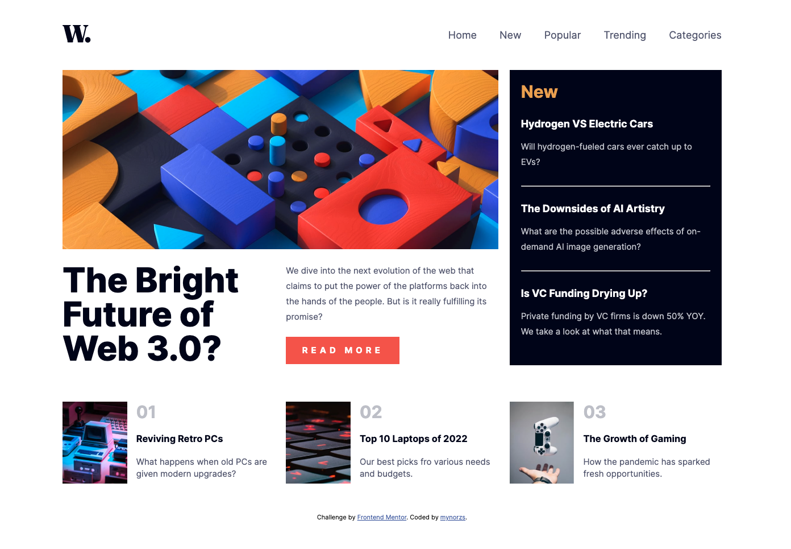

# Frontend Mentor - News homepage solution

This is a solution to the [News homepage challenge on Frontend Mentor](https://www.frontendmentor.io/challenges/news-homepage-H6SWTa1MFl). Frontend Mentor challenges help you improve your coding skills by building realistic projects. 

## Table of contents

- [Overview](#overview)
  - [The challenge](#the-challenge)
  - [Screenshot](#screenshot)
- [My process](#my-process)
  - [Built with](#built-with)
  - [What I learned](#what-i-learned)
  - [Continued development](#continued-development)
- [Author](#author)

## Overview

### The challenge

Users should be able to:

- View the optimal layout for the interface depending on their device's screen size
- See hover and focus states for all interactive elements on the page

### Screenshot

## My process

### Built with

- Semantic HTML5 markup
- CSS custom properties
- Flexbox
- CSS Grid
- Mobile-first workflow

### What I learned

With this challenge I learned to use grid and how to be efficient with grid css. I learned how to avoid using !important and some element position details.

### Continued development

I want to be more effecti with mobile menus, I feel it a bit clunky still, so with practive I hope to give it a better structure and make a more efficient code.

## Author

- Website - [Add your name here](https:/www.mynorzuniga.myportfolio.com)
- Frontend Mentor - [@yourusername](https://www.frontendmentor.io/profile/mynorzs)

## Acknowledgments

